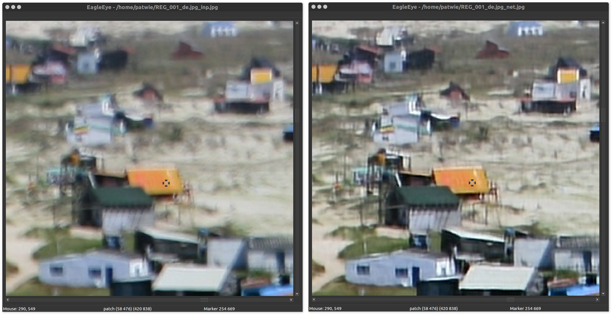

# EagleEye

A scientific image viewer inspired by [shiver/idisplay](https://sourceforge.net/p/shiver/idisplay). It features an OpenGL-based canvas to display images with dragging and zooming. These actions are further synchronized across different windows.

This is currently under development and lacks some of the original features. It uses FreeImage to load the images.

  

## Features

- drop placement of images
- OpenGL accelerated viewer
- synchronize views when moving and zooming
- mipmap based datastructure
- set marker on pixels

## Requirements

- Qt5.9
- FreeImage library

## Install

    # install dependencies
    sudo apt-get install libfreeimage3 libfreeimage-dev
    # install Qt5.9
    cd /tmp
    wget http://download.qt.io/official_releases/qt/5.9/5.9.1/qt-opensource-linux-x64-5.9.1.run
    chmod +x qt-opensource-linux-x64-5.9.1.run
    ./qt-opensource-linux-x64-5.9.1.run
    # clone this repo
    git clone git@github.com:PatWie/eagleeye.git
    cd eagleeye
    mkdir build
    cd build
    qmake ..
    make

edit `eagle_eye.desktop` and adjust the paths. Then 

    cp eagle_eye.desktop $HOME/.local/share/applications/eagle_eye.desktop

and you find the app in the Ubuntu searchbar.

## Keyboard Shortcuts
- key_down: next image
- key_right: next image
- key_up: previous image
- key_left: previous image
- Ctrl+O: open image
- Ctrl+N: new canvas
- Ctrl+W: quit canvas
- Ctrl+plus: zoom in
- Ctrl+minus: zoom out
